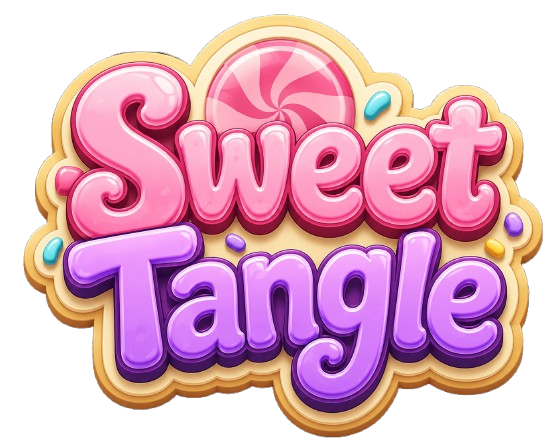
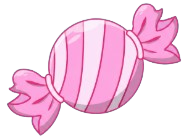

# Sweet Tangle

Juego tipo **match-3** en Unity 6 (2D URP). Intercambia dulces adyacentes, forma líneas de 3 o más y suma puntos hasta alcanzar la meta.

<p align="center">
  
</p>

## Capturas y arte

| Logo | Ficha (ejemplo) |
|:---:|:---:|
|  |  |

### Mensajes de juego (UI)

| Genial (match de 3) | Estupendo (combo / 4+) | Movimiento inválido | ¡Haz ganado! (300 pts) |
|:---:|:---:|:---:|:---:|
|  |  |  |  |

> El fondo del tablero está en `Assets/Art/Backgrounds/Background.png`.

## Requisitos

- **Unity** `6000.4.3f1` o compatible (ver `ProjectSettings/ProjectVersion.txt`)
- Plantilla **2D URP**

## Cómo ejecutar

1. Clona o abre la carpeta del proyecto en Unity Hub.
2. Abre la escena `Assets/Scenes/SampleScene.unity`.
3. Pulsa **Play** — el juego se crea solo al iniciar (no hace falta colocar scripts en escena).

### Controles

| Acción | Control |
|--------|---------|
| Seleccionar / intercambiar | Clic en dos fichas adyacentes |
| Arrastrar | Arrastrar una ficha hacia un vecino |
| Mover cámara | WASD o flechas |
| Zoom | Rueda del ratón, **Q** / **E** |

## Reglas de puntaje

- Cada movimiento **válido**: **+3** puntos (máximo **300**).
- Movimiento **inválido**: **−3** puntos (mínimo 0).
- Al llegar a **300**: mensaje aleatorio `HazGanado` / `HazGanado_Alt` y el puntaje **vuelve a 0**.
- Mensajes según la jugada:
  - Solo **3 dulces** en línea → **Genial**
  - **Combo**, cascada o línea de **4+** → **Estupendo**
  - Sin match → **Movimiento inválido**

## Estructura del proyecto

```
Sweet Tangle/                 ← raíz del repo (aquí va git init)
├── Assets/
│   ├── Art/
│   │   ├── Sprites/          # Fichas (Sheet 1–5)
│   │   ├── Backgrounds/      # Fondo del tablero
│   │   └── UI/               # Logo, mensajes, feedback
│   ├── Scenes/
│   │   └── SampleScene.unity
│   ├── Scripts/
│   │   ├── SweetTangleGame.cs
│   │   ├── SweetTangleHud.cs
│   │   ├── SweetTangleCameraController.cs
│   │   └── TilePiece.cs
│   └── Settings/               # URP 2D
├── Packages/
├── ProjectSettings/
├── Docs/
│   └── screenshots/          # Imágenes para este README
├── .gitignore
└── README.md
```

## Git: dónde inicializar y qué ignorar

**Sí: `git init` en la raíz del proyecto** (la carpeta que contiene `Assets/`, `Packages/` y `ProjectSettings/`), por ejemplo:

```bash
cd "/ruta/a/Sweet Tangle"
git init
git add .
git commit -m "Initial commit: Sweet Tangle Unity project"
```

### Qué **no** subir (ya está en `.gitignore`)

| Carpeta / archivo | Motivo | Tamaño aprox. |
|-------------------|--------|----------------|
| `Library/` | Caché e importación de Unity | ~2 GB |
| `Logs/` | Registros locales | — |
| `UserSettings/` | Layout del editor, preferencias personales | — |
| `Temp/`, `Obj/`, `Build/` | Generados al compilar | — |

### Qué **sí** versionar

- `Assets/` (código, escenas, arte, `.meta`)
- `Packages/manifest.json` y `packages-lock.json` (si existe)
- `ProjectSettings/`
- `Docs/`, `README.md`, `.gitignore`

Con el `.gitignore` incluido, el repositorio pesa del orden de **~7 MB** en lugar de **~2 GB**.

```bash
# Comprobar qué se va a commitear antes del primer push
git status
```

## Scripts principales

| Script | Función |
|--------|---------|
| `SweetTangleGame` | Tablero, input, matches, colapso, fondo alineado al grid |
| `SweetTangleHud` | Puntaje, logo, mensajes con sprites |
| `SweetTangleCameraController` | Pan y zoom de cámara |
| `TilePiece` | Ficha individual (tipo, selección, hint) |

## Licencia

Proyecto personal / educativo. Ajusta la licencia según necesites.
